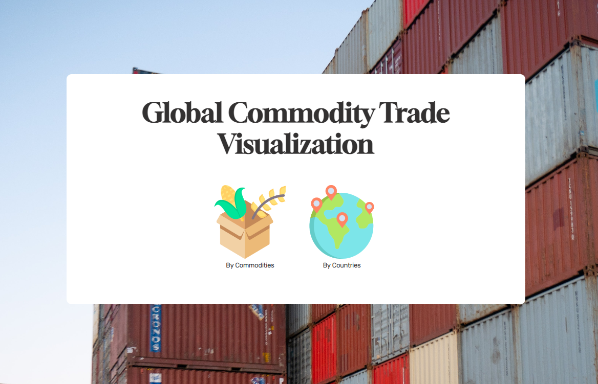
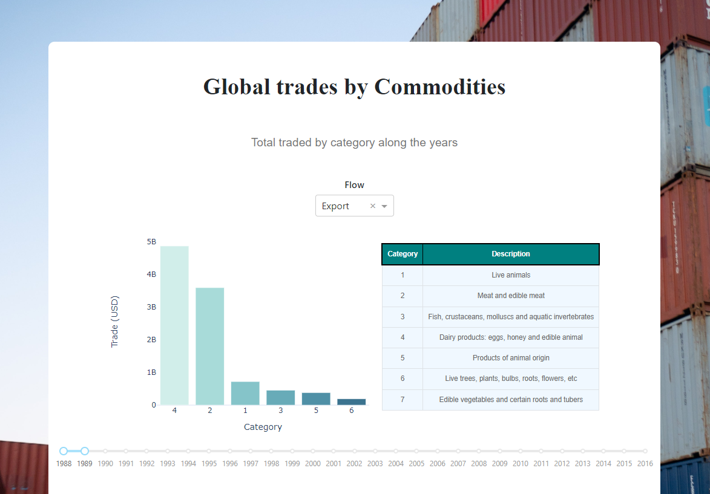
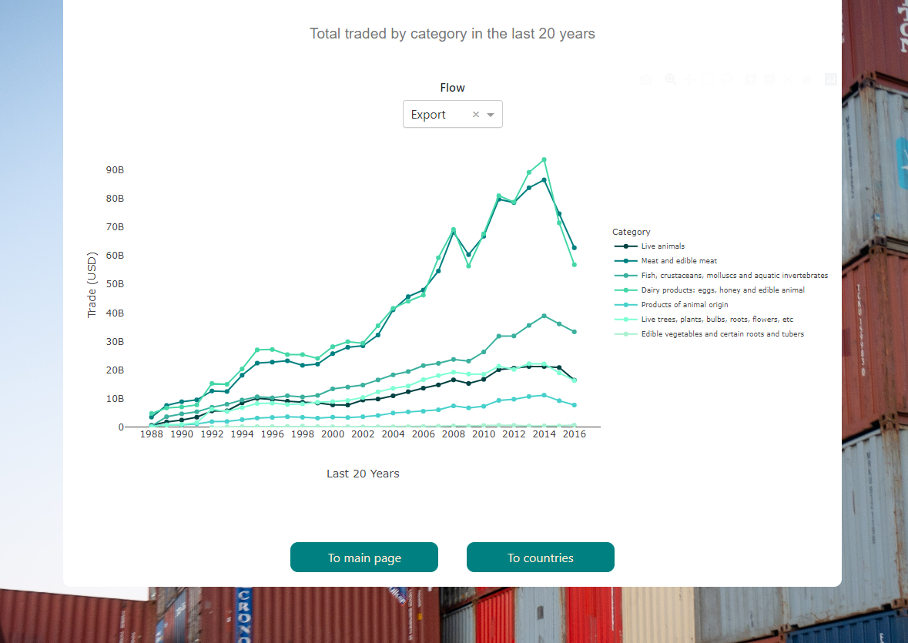
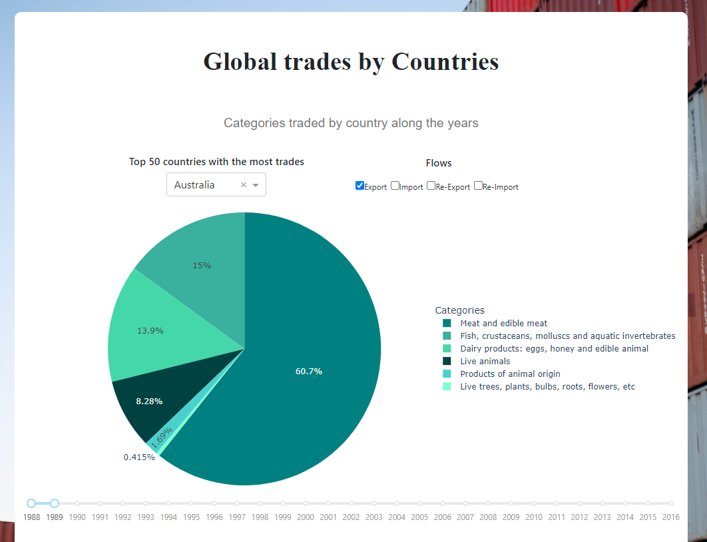
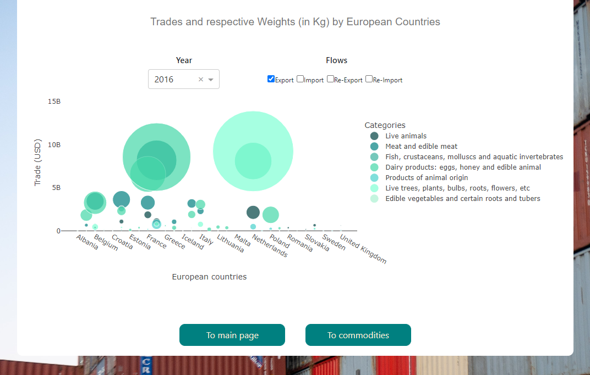

# Visualize Global Commodity Trade Dataset using Flask, Dash and Plotly

This project aims to analyse global trades by commodities and countries. The dataset for this project can be found here: [Global Commodity Trade Statistics](https://www.kaggle.com/datasets/unitednations/global-commodity-trade-statistics?resource=download)

## Instructions

- Download the dataset from kaggle and save it in 'data' as 'commodity_trade_statistics_data.csv'.
- Install the python libraries in the requirements.txt. 

## Introduction

I used Flask, Dash and Plotly to visualize the data. The project is composed of three pages. Being that, the main page is rendered by Flask and the other two by Dash, having the Plotly graphs inside.

### Main Page

From this page we have access to two other pages, one having data visualization regarding the commmodities, and another one, concerning the countries.

### Commodities Page

In this page, we have two plots and one table. In the bottom, there are two buttons that allow to swith page.

#### Bar Plot

The bar plot shows the total trades in USD per category of commodity along the years. It takes two inputs, the years' range and the flow (import, export, etc...). For the first input, I used a slider, to get the range, and for the flows I used a dropdown menu.
Just next to the bar plot, we can see a table that was built using bootstrap components (*dash_bootstrap_components*).

#### Line plot

The line plot shows the total trades in USD per year, and displays different traces for each category. This plot allows to see the evolution of the trades along the years. It only takes the flow as the input, which is rendered using a dropdown menu.

### Countries Page

In this page, we have a pie plot and a scatter plot (aka bubble plot).

#### Pie Plot

The pie plot shows the trades per category (commodities) by country . It allows to choose from the 50 countries that have the most trades. These countries are displayed in a dropdown menu. The other input (flow), is represented using a checklist. Finally it takes also the year range as input (displayed using a slider), in total it accepts 3 inputs.

#### Bubble plot

This scatter plot can be a little confusing. It displays the trades per European Countries, and the size of the markers represent the weight (in Kg) of the produts from the category. It takes the year and the flow as input. The first using a dropdown menu,  and the second the checklist.

## Conclusions

The dataset is huge, therefore the options for data visualization are numerous. For example, it gets difficult to display all the commodities, either as input or output. So I decided to work with categories instead. But, it would be interesting to tackle more precise information, for example by taking certain commodities or countries. This could allow to implement other types of plots, such as cloropleth graphs. It also lacks of more statistical information, a boxplot or a heatmap could be interesting options to add in the future. 
